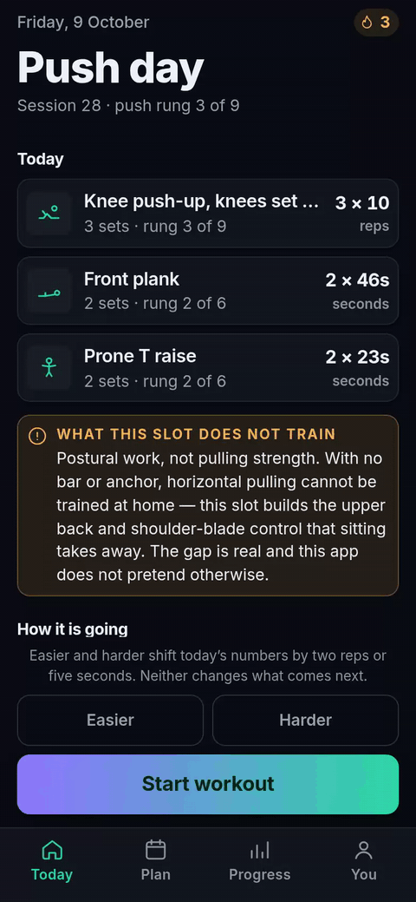
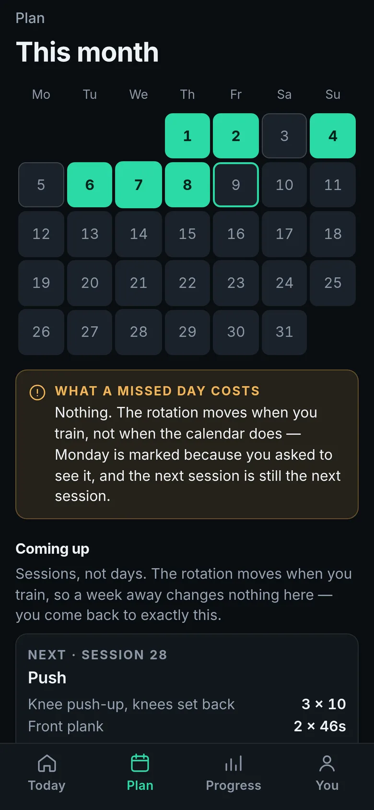
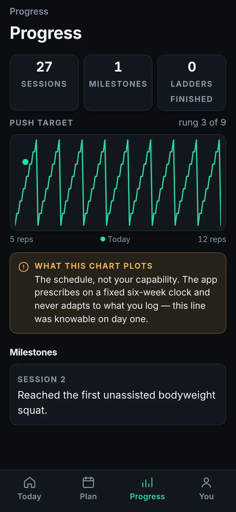
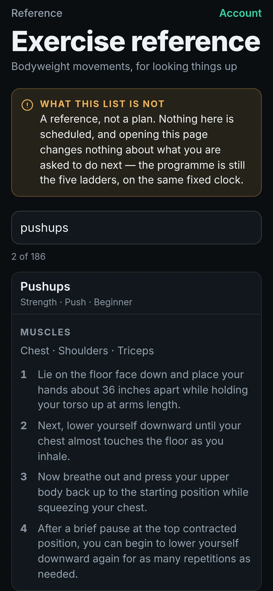
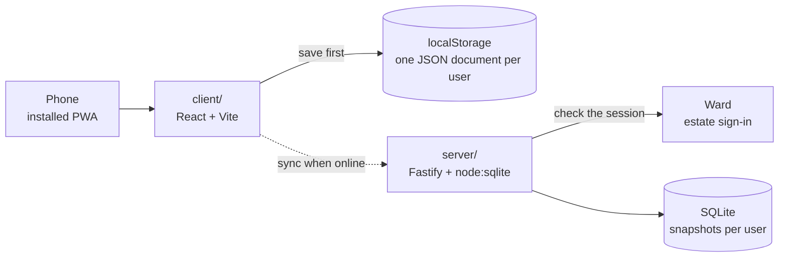

# sports-app

A zero-equipment calisthenics trainer for a returning beginner who trains at home, on the floor. It opens on today's session, already decided, and walks you through it one exercise per page.

<p align="center">
  
</p>

**Status:** Personal project, live at <https://gandolh.ro/sports-app/>. Every screen works once the app knows your username, but signing in does not finish yet. After Ward's sign-in page the app never stores who signed in, so a fresh browser lands on sign-in again. The workaround is in [docs/getting-started.md](docs/getting-started.md#signing-in-loops).

## What it does

- Opens on today's session. The rotation is Push, Legs, Cardio, with a core and posture block every day, and it moves only when you train. Miss a week and the next session is still the next session.
- Shows one exercise per page: an animated figure, the target, a dot per set and a Next button. Holds get a countdown that is only a guide; Next always works.
- Lets you call it an easier or harder day, which shifts today's numbers by two reps or five seconds and changes nothing after today.
- Raises the targets on a fixed schedule, about one rung every six weeks. A rung is the same movement made harder by tempo, pauses, range or leverage, never a new exercise.
- Lets you log each set if you want to. The player shows what you logged last time; the schedule never reads it.
- Says on screen what floor training cannot do. The pull slot is posture work, because pulling strength needs a bar.

Hevy, Strong and Freeletics are built around logging and charts. This one makes the decision before you open it and follows a schedule you could read on day one. It needs no equipment. It has no rest timer, no audio cues and no adaptive progression, on purpose.

## Screenshots

| This month and the next sessions | The push target across the ladder | 186 bodyweight exercises to look up |
|---|---|---|
|  |  |  |

The screens show a made-up account, `demo`, with 27 generated sessions. How each image was made: [docs/images/shots.md](docs/images/shots.md).

## How it works

`client/` is a React and Vite PWA that works offline. Today's prescription is a pure function of how many sessions you have done per movement pattern; it lives in `client/src/domain/`, where eslint rejects any clock read, browser API or random number. Your history is one plain JSON document in `localStorage`. After each session the client saves it there first, then sends the whole document to `server/`, a Fastify service on `node:sqlite` that keeps snapshots keyed by your Ward account. If that fails, you lose a log line, not a workout. `shared/` holds the document types and API schemas both sides import.



More on the [docs site](https://gandolh.ro/sports-app/docs/): [architecture](https://gandolh.ro/sports-app/docs/wiki/architecture/), [the progression engine](https://gandolh.ro/sports-app/docs/wiki/progression-engine/) and [state and sync](https://gandolh.ro/sports-app/docs/state/).

## Run it locally

Requires Node 22.18 or later. Signing in and sync also need the estate's Ward, run locally from `../wzd_auth/infrastructure/local`.

```bash
npm install
cp .env.example .env
npm run dev        # http://localhost:5173/sports-app/
```

The state service, env vars, tests and the sign-in workaround: [docs/getting-started.md](docs/getting-started.md).

## Project layout

| Path | What lives there |
|---|---|
| `client/` | The PWA. `src/domain/` is the schedule and the ladders, `src/ui/` the screens |
| `server/` | The state service, with its own [README](server/README.md) |
| `shared/` | Document types, the username rule and the API schemas |
| `docs/` | The Starlight docs site, plus the images in this README |
| `corpus/` | Project wiki and briefs: decisions, programme, status |
| `infrastructure/` | Dockerfile and compose file for the state service |
| `scripts/` | `import-library.mjs`, which rebuilds the exercise reference |

## Docs

- [docs/](docs/README.md): setup and the images used here
- Docs site: <https://gandolh.ro/sports-app/docs/>, built from `docs/`
- Project wiki: [corpus/](corpus/index.md), with the programme, the training science behind it, and every decision
- [PRODUCT.md](PRODUCT.md) for who it is for; [SPEC.md](SPEC.md) is the v1 design and partly out of date

## License

No license; all rights reserved. The exercise reference is imported from free-exercise-db, which is public domain. [NOTICE.md](NOTICE.md) says what was imported and why, and [corpus/wiki/licensing.md](corpus/wiki/licensing.md) has the licence history.
